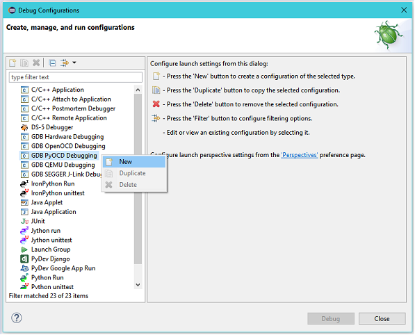
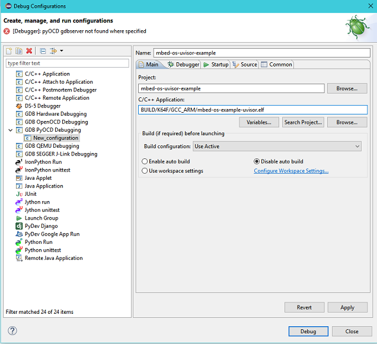
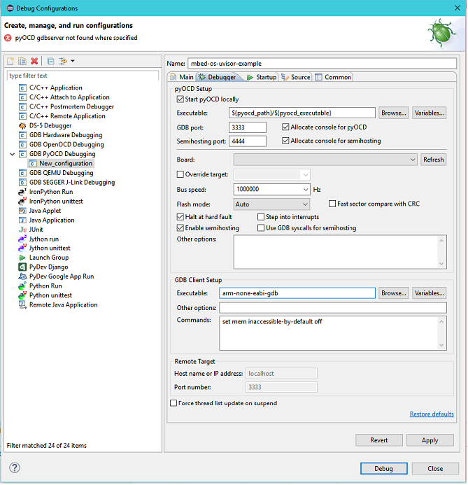
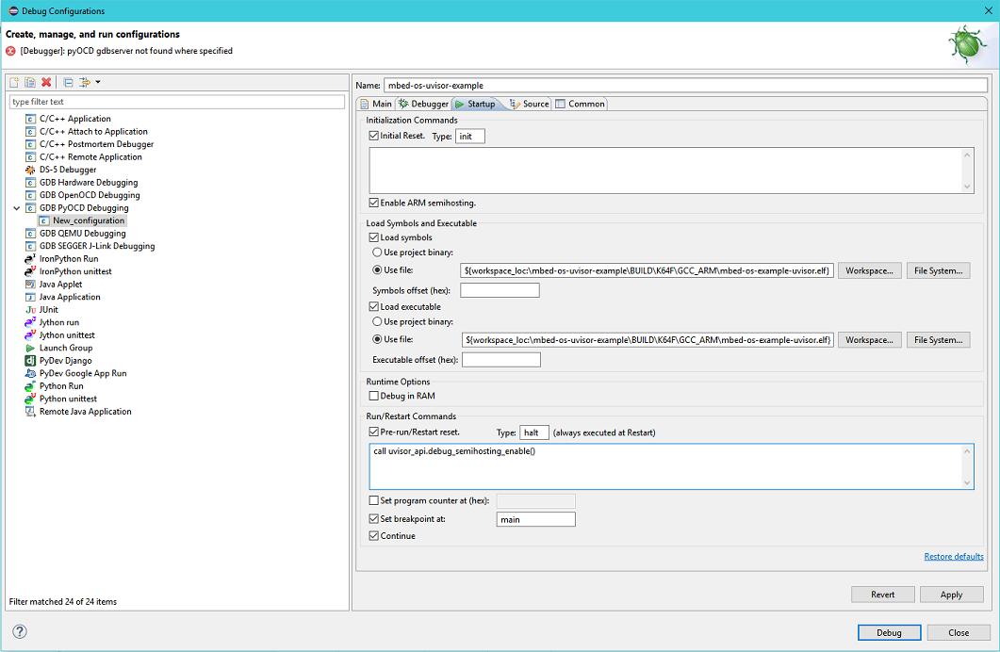

# Debugging uVisor on mbed OS

uVisor is distributed as a prelinked binary blob. Blobs for different mbed platforms are released in the mbed OS repository, [ARMmbed/mbed-os](https://github.com/ARMmbed/mbed-os), and are linked to your application when you build it. Two classes of binary blobs are released for each version — one for release and one for debug.

If you want to use the uVisor debug features on an already supported platform, you do not need to clone it and build it locally. If you instead want to make modifications to uVisor (or port it to your platform) and test the modifications locally with your app, please follow the [Developing with uVisor locally on mbed OS](../core/DEVELOPING_LOCALLY.md) guide first.

This guide will show you how to enable the default debug features on uVisor and how to use it to get even more debug information. You will need:

- A GDB-enabled board (and the related tools).
- A [target](../../README.md#supported-platforms) uVisor supports on mbed OS. If uVisor does not support your target yet, you can follow the [uVisor porting guide for mbed OS](../core/PORTING.md).
- The Launchpad [GNU ARM Embedded](https://launchpad.net/-arm-embedded) Toolchain.
- GNU Make.
- Git.

## Debug capabilities

The uVisor provides two main sources of debug information:

- Runtime messages. These are delivered through [semihosting](http://infocenter.arm.com/help/index.jsp?topic=/com.arm.doc.dui0471l/pge1358787045051.html), which requires a debugger to be connected to the device. Currently, debug messages implement some of the security-critical features of uVisor, such as boot and startup configuration, interrupts management and context switching. A postmortem screen is also output when the system halts due to a fault.

- Debug box drivers. We call a secure box that registers with uVisor to handle debug events and messages a *debug box*. The uVisor provides a predefined function table that describes the driver and its capabilities. Different debug boxes can implement these handlers differently, independently from uVisor. All handlers are executed in unprivileged mode.

Runtime messages and debug box handlers are independent from each other. Even if an application does not include a debug box, the uVisor can deliver basic runtime messages. Conversely, an application that includes a debug box will handle debug events even if you use the release build of uVisor and possibly even without a debugger connected.

## Enabling runtime messages

If you want to observe the uVisor runtime messages, connect a debugger to your board. Use the Hello World application for this guide, which is built for the NXP FRDM-K64F target:

```bash
$ cd ~/code
$ mbed import https://github.com/ARMmbed/mbed-os-example-uvisor
$ cd mbed-os-example-uvisor
```

You can also use any other application that is set up to use uVisor. See [Developing with uVisor locally on mbed OS](../core/DEVELOPING_LOCALLY.md) for more details. Runtime messages are silenced by default. In order to enable them, you need to build your application linking to the debug version of uVisor. The uVisor libraries that we publish in mbed OS provide both the release and debug builds of uVisor, so you only need to run the following command:

```bash
$ mbed compile -m ${your_target} -t GCC_ARM -c --profile mbed-os/tools/profiles/debug.json
```

The `--profile mbed-os/tools/profiles/debug.json` option ensures that the build system enables debug symbols and disables optimizations. In addition, it ensures the selection of the debug build of uVisor, which enables the uVisor runtime messages.

Now start the GDB server. This step changes depending on which debugger you are using.

* If you are using a J-Link debugger, run:

  ```bash
  $ JLinkGDBServer -device ${device_name} -if ${interface}
  ```

  In the command above, `${device_name}` and `${interface}` are J-Link-specific. Please see the [J-Link documentation](https://www.segger.com/admin/uploads/productDocs/UM08001_JLink.pdf) and the list of [supported devices](https://www.segger.com/jlink_supported_devices.html).

* If you are using a PyOCD debugger, run:

  ```bash
  $ pyocd-gdbserver --semihosting
  ```

To flash the device, use GDB, even if your device allows drag and drop flashing. This allows you to potentially group several commands together into a startup GDB script.

Connect to the GDB server. You can use `arm-none-eabi-gdb`, which comes with the Launchpad GNU ARM Embedded Toolchain. Other equivalent tools will work similarly.

```
$ arm-none-eabi-gdb
GNU gdb (GNU Tools for ARM Embedded Processors) 7.8.0.20150604-cvs
Copyright (C) 2014 Free Software Foundation, Inc.
License GPLv3+: GNU GPL version 3 or later <http://gnu.org/licenses/gpl.html>
(gdb) ...
```

The following is the minimum set of commands you need to send to the device to flash and run the binary:

* For J-Link debugger:

  ```bash
  (gdb) target remote localhost:2331
  (gdb) monitor endian little
  (gdb) monitor reset
  (gdb) monitor halt
  (gdb) monitor semihosting enable
  (gdb) monitor speed 1000
  (gdb) monitor loadbin BUILD/${target}/${your_app}.bin 0
  (gdb) monitor flash device = ${device_name}
  (gdb) load BUILD/${target}/${your_app}.elf
  (gdb) file BUILD/${target}/${your_app}.elf
  (gdb) call uvisor_api.debug_semihosting_enable()
  ```

* For PyOCD debugger:

  ```bash
  (gdb) target remote localhost:3333
  (gdb) monitor reset
  (gdb) monitor halt
  (gdb) load BUILD/${target}/${your_app}.elf
  (gdb) file BUILD/${target}/${your_app}.elf
  (gdb) call uvisor_api.debug_semihosting_enable()
  ```

---
**IMPORTANT**
* The call to `uvisor_api.debug_semihosting_enable` is required to enable semihosting debug printing.
  The reason for this "safety latch" is that the device faults on semihosting prints if a debugger is not connected.
  On some devices it's hard to tell programmatically if a debugger is connected so semihosting is disabled by default and is enabled using this "safety latch".

* If you wish to debug uVisor core as well you have to add the uVisor symbols:
  ```bash
  (gdb) add-symbol-file   mbedos/features/FEATURE_UVISOR/importer/TARGET_IGNORE/uvisor/platform/${family}/debug/configuration_${family}_${core_version}_${sram_origin}.elf __uvisor_main_start
  ```
---

From here on, if you send the `c` command, the program will run indefinitely. Of course, you can configure other addresses and ports for the target. Please refer to the [GDB documentation](http://www.gnu.org/software/gdb/documentation/) for details about the GDB commands.

You can also group these commands in a script and pass it directly to `arm-none-eabi-gdb`:

```bash
$ arm-none-eabi-gdb -x gdb.script
```

You can observe the debug messages using `netcat` or any other equivalent program (replace '2333' by '4444' if you use pyOCD or OpenOCD as a debug server):

```bash
$ nc localhost 2333
```

As with the GDB server, you can change the port if you want.

The following messages are printed:

- Startup and initialization routines.
- Runtime assertions (failed sanity checks).
- vIRQ operations: Registering, enabling, disabling and releasing interrupts.
- Faults: For all type of faults, a default blue screen is printed. It contains the following information:
    - MPU configurations.
    - Relevant fault status registers.
    - Faulting address.
    - Exception stack frame.
- Specific fault handlers might include additional information relevant to the fault.

### Limitations

- There is currently only one level of verbosity available, which prints all possible messages.

- Debug messages are functionally blocking, meaning that if uVisor runs with debug enabled and a debugger is not connected, the system will halt and wait for a semihosting connection.

- Debug messages might interfere with timing constraints because they are shown while running in the highest priority level. Applications that have strict timing requirements might show some unexpected behavior.

## The debug box

> **Warning**: The debug box feature is an early prototype. The APIs and procedures described here may change in nonbackward-compatible ways.

The uVisor code is instrumented to output debug information when it is relevant. To keep the uVisor as simple and hardware-independent as possible, uVisor does not handle and directly interpret some of this information.

Instead, debug events and messages are forwarded to a special unprivileged box, called a *debug box*. A debug box is configured just like any other secure box, but it registers with uVisor to handle debug callbacks. These callbacks must adhere to a format that uVisor provides, in the form of a debug box driver.

The debug box driver is encoded in a standard table (a C `struct`) that a debug box must populate statically. A debug box can decide to implement only some of the available handlers though they must all exist at least as empty functions. Otherwise, the program behavior might be unpredictable.

The debug handler — `halt_error` — only executes once, so if another fault occurs during its execution, the uVisor does not deprivilege again. It halts instead.

Debug box handlers can also reset the device by calling the `NVIC_SystemReset()` API. This API cannot be called from other secure boxes.

For a reference implementation of a debug box please refer to [mbed-os-example-uvisor-debug-fault repository](https://github.com/ARMmbed/mbed-os-example-uvisor-debug-fault)

## Platform-specific details

This section provides details about how to enable debug on specific hardware platforms.

### NXP FRDM-K64F

The board features both a GDB-enabled on-board USB controller and a JTAG port. To use the on-board USB, you must have the latest bootloader with the OpenSDA v2.0 firmware:

- [OpenSDA bootloader](http://www.nxp.com/products/software-and-tools/run-time-software/kinetis-software-and-tools/ides-for-kinetis-mcus/opensda-serial-and-debug-adapter:OPENSDA).
- [Instructions](https://developer.mbed.org/handbook/Firmware-FRDM-K64F) about how to reflash the bootloader.

The OpenSDA port provides a debugger interface, which is compatible with the Segger J-Link Lite debugger. This means that you can use the [Segger J-Link tools](https://www.segger.com/jlink-software.html) and the examples this guide provides.

To use the JTAG port instead, download the tools and drivers for the debugger of your choice.

### STMicroelectronics STM32F429I-DISCO

This board provides both an on-board proprietary debugging port (ST-LINK) and a JTAG port. The latter is spread out across the GPIO pins on the board.

If you are using ST-LINK, please refer to the [STMicroelectronics website](http://www.st.com/web/catalog/tools/FM146/CL1984/SC724/SS1677/PF251168?sc=internet/evalboard/product/251168.jsp) for information about the tools and drivers you need. Please note we have not tested this debugger with uVisor.

If instead you want to connect your debugger to the JTAG port, you must wire the needed pins to your connector. This [guide](https://www.segger.com/admin/uploads/evalBoardDocs/AN00015_ConnectingJLinkToSTM32F429Discovery.pdf) explains how to do that in detail. The guide is specific to the J-Link connectors, but you can apply it to other connectors.

## Debugging with Eclipse

* Make sure [GNU ARM Eclipse plugins](http://gnuarmeclipse.sourceforge.net/updates) is installed, if not then install:

  `help -> Install New software -> Add http://gnuarmeclipse.sourceforge.net/updates`

### Eclipse PyOCD debugger configuration

* Create a new *GDB PyOCD Debugging* configuration:

  `Run -> Debug configurations -> New`
  
  
  
* **Main** tab configuration
  * Give the path to the .elf of the application in *C/C++ Application*.
  * Set *Disable auto build* if your eclipse project does not build the application.
  
  
  
* **Debugger** tab configuration
  * Keep *pyOCD Setup* as-is (PyOCD binary has to be in the PATH).
  * In *GDB Client Setup* set the *Executable* to **arm-none-eabi-gdb** (which needs to be in the PATH as well).
  
  

* **Startup** tab configuration
  * In *load Symbols and Executable* se both to the location of the application .elf file.
  * In *Run/Restart Commands* add `call uvisor_api.debug_semihosting_enable()` to the text box.
    * If you wish to debug uVisor core as well you have to add the uVisor symbols, so add this to the text box:
    ```bash
    add-symbol-file  mbedos/features/FEATURE_UVISOR/importer/TARGET_IGNORE/uvisor/platform/${family}/debug/configuration_${family}_${core_version}_${sram_origin}.elf __uvisor_main_start
    ```

  

* Now press **Debug** and the debugger will start and stop at a breakpoint in `main()`.
